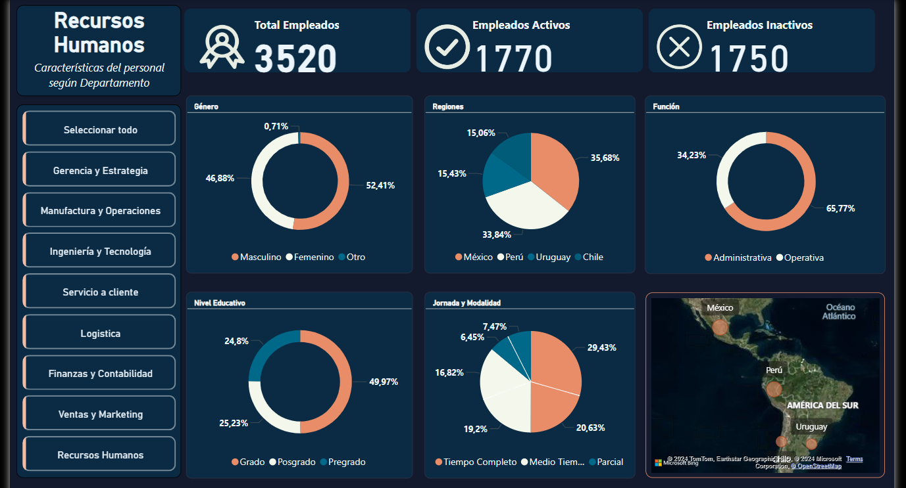

# HR Employee Analysis with Power BI

## Project Overview

This project aims to analyze the employee data in the Human Resources (HR) department using Power BI. The analysis includes calculating the total number of employees, as well as distinguishing between active and inactive employees.

